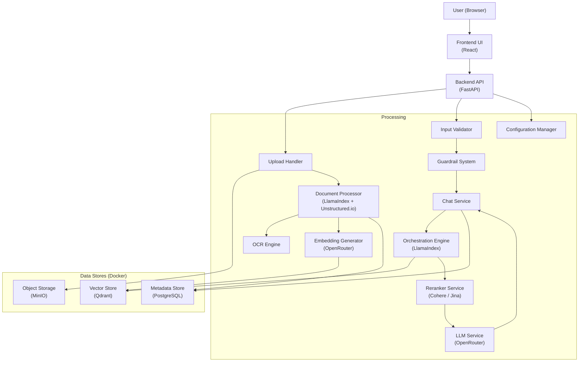

# Design Document: RAG Chatbot Application

## Overview

The RAG Chatbot Application is a full-stack system that enables users to upload documents, process them into searchable vector embeddings, and query their content through a natural language chat interface. The system follows the Retrieval-Augmented Generation (RAG) pattern: at query time, relevant document chunks are retrieved from a vector store, reranked for relevance, and injected into a prompt sent to an LLM to produce a grounded answer.

### Key Design Goals

- **Modularity**: Each major concern (document ingestion, embedding, retrieval, reranking, response generation) is isolated in its own component so they can evolve independently.
- **Correctness over speed**: Reranking and contextual chunking are applied to maximise answer quality rather than minimising latency.
- **Observability**: Every API request, document-processing event, and error is logged with enough context to diagnose failures quickly.
- **Security**: All user-supplied text is sanitised before use; file uploads are validated against content type, extension, and size before storage.

### Technology Stack

| Layer | Technology |
|---|---|
| Frontend | React (TypeScript) |
| Backend API | FastAPI (Python) |
| Document Parsing | LlamaIndex + Unstructured.io |
| OCR | Unstructured.io (image/PDF-embedded images) |
| Embedding | OpenRouter embedding models |
| LLM | OpenRouter language models |
| Vector Store | Qdrant |
| Object Storage | MinIO |
| Metadata / Chat History | PostgreSQL |
| Reranking | Cohere Rerank v3 / Jina Reranker v2 |
| Container Orchestration | Docker Compose |

---

## Architecture

The application is divided into three deployment tiers:

1. **Frontend** – a React SPA served separately that communicates with the Backend API over HTTP.
2. **Backend API** – a FastAPI application that implements all REST endpoints and orchestrates the internal services.
3. **Data Services** – Qdrant, MinIO, and PostgreSQL, each running as a Docker container managed by Docker Compose.



### Request Flows

**Document Upload Flow**
1. User selects a file in the Frontend.
2. `POST /documents/upload` arrives at the Backend API.
3. Upload Handler validates extension, MIME type, size, and scans for malicious content.
4. File is stored in MinIO; metadata record is created in PostgreSQL.
5. Document Processor parses the file (LlamaIndex / Unstructured.io / OCR), chunks the content, and generates embeddings via OpenRouter.
6. Embeddings + metadata are written to Qdrant.
7. Processing status in PostgreSQL is updated to `completed` (or `failed`).

**Chat Query Flow**
1. User submits a query in the Frontend.
2. `POST /chat/query` arrives at the Backend API.
3. Input Validator sanitises text; Guardrail System checks for injection and scope violations.
4. Embedding Generator creates a query embedding via OpenRouter.
5. Orchestration Engine retrieves top-20 chunks from Qdrant by cosine similarity.
6. Reranker Service reranks those chunks, returning the top 5.
7. Orchestration Engine builds the prompt (system instructions + context + query), truncating if needed.
8. LLM Service calls OpenRouter; the answer is returned to the user.
9. The full interaction is persisted to PostgreSQL.

---

## Components and Interfaces

### Upload Handler

Responsible for: extension validation, MIME-type checking, size enforcement (≤ 50 MB general, ≤ 10 MB per Requirement 4.4), malicious-content scanning, MinIO storage, unique file-ID generation.

```python
class UploadHandler:
    def upload(self, file: UploadFile) -> UploadResult:
        """Validates and stores an uploaded file. Returns document_id."""

    def _validate_extension(self, filename: str) -> bool:
        """Returns True iff the extension is in the allowed set."""

    def _scan_for_malicious_content(self, file_bytes: bytes) -> ScanResult:
        """Detects executable, script, or embedded-malicious-code payloads."""

    def _store_in_object_storage(self, document_id: str, file_bytes: bytes) -> None:
        """Persists file to MinIO bucket."""
```

**Note on conflicting size limits**: Requirement 1.9 caps uploads at 50 MB; Requirement 4.4 caps them at 10 MB. The stricter limit of **10 MB** is enforced at the API layer (Requirement 7.1 also states 10 MB), with the 50 MB value treated as a legacy reference.

### Document Processor

Responsible for: dispatching to the correct parser (LlamaIndex for PDF/DOCX, Unstructured.io for PPTX/Excel, OCR for images), applying recursive chunking with contextual summaries, retrying embedding generation, writing embeddings to Qdrant, and updating processing status in PostgreSQL.

```python
class DocumentProcessor:
    def process(self, document_id: str, file_bytes: bytes, format: str) -> ProcessingResult:
        """Full pipeline: parse → chunk → embed → index."""

    def _parse(self, file_bytes: bytes, format: str) -> List[TextNode]:
        """Dispatches to LlamaIndex, Unstructured.io, or OCR."""

    def _chunk(self, nodes: List[TextNode]) -> List[Chunk]:
        """Applies recursive chunking (300–500 tokens, 10–15% overlap) with contextual summaries."""

    def _embed_with_retry(self, chunk: Chunk, max_retries: int = 3) -> List[float]:
        """Generates embedding via OpenRouter; retries up to 3 times on timeout."""
```

### Embedding Generator

Thin wrapper around the OpenRouter embedding API. Enforces a 30-second per-chunk timeout and exposes retry logic consumed by the Document Processor and the Chat Service.

### Chat Service

Orchestrates the full query lifecycle: validates input, delegates to Orchestration Engine, calls LLM Service, persists the interaction, and handles error cases.

```python
class ChatService:
    def query(self, session_id: str, user_query: str) -> ChatResponse:
        """End-to-end query handling."""

    def get_history(self, session_id: str) -> List[ChatMessage]:
        """Returns stored messages for the session."""
```

### Orchestration Engine

Built on LlamaIndex's query pipeline. Responsible for: vector retrieval (top-20), passing chunks to the Reranker, selecting top-5 after reranking, building the final prompt, enforcing the 8000-character prompt length limit, and delegating to the LLM Service.

### Reranker Service

Provides a provider-agnostic reranking interface. The active provider is determined at startup from configuration.

```python
class RerankerService:
    def rerank(self, query: str, chunks: List[Chunk]) -> List[RankedChunk]:
        """Reranks chunks and returns them sorted by descending score."""
```

### Input Validator

Validates and sanitises all user-supplied text before it enters the pipeline. Checks: empty / whitespace-only strings, length limits (query ≤ 2000 characters), HTML-tag escaping, SQL-injection pattern removal, prompt-injection patterns.

### Guardrail System

Secondary filter applied after Input Validator. Checks prompt-injection patterns (instruction overrides, role manipulation, system-prompt extraction), scope violations, and the hard 4000-character length ceiling.

### Configuration Manager

Loads JSON/YAML configuration files from a designated directory at startup. Validates all parameters against defined ranges. Supports hot-reload within 5 seconds. Falls back to the previous valid configuration if reload fails validation.

```python
class ConfigurationManager:
    def load(self) -> AppConfig:
        """Loads and validates configuration from disk."""

    def reload(self) -> ReloadResult:
        """Hot-reloads configuration; retains previous config on validation failure."""

    def get(self, key: str) -> Any:
        """Returns the current value for a configuration key."""
```

### Backend API (FastAPI)

| Method | Path | Description |
|---|---|---|
| POST | /documents/upload | Upload a document file |
| GET | /documents | List uploaded documents (paginated) |
| DELETE | /documents/{document_id} | Delete document, embeddings, and metadata |
| POST | /chat/query | Submit a natural-language query |
| GET | /chat/history | Retrieve session chat history |

All endpoints implement CORS (origin from env var), rate limiting (100 req / 60 s), and structured error responses.

---

## Data Models

### Document Metadata (PostgreSQL)

```sql
CREATE TABLE documents (
    document_id       UUID PRIMARY KEY,
    filename          TEXT NOT NULL,
    upload_timestamp  TIMESTAMPTZ NOT NULL DEFAULT NOW(),
    file_size_bytes   BIGINT NOT NULL,
    format            TEXT NOT NULL,           -- pdf, docx, pptx, xlsx, xls, txt, png, jpg, jpeg
    processing_status TEXT NOT NULL            -- pending, processing, completed, failed
);
```

### Chunk Embedding Metadata (Qdrant payload)

Each vector point in Qdrant carries a JSON payload:

```json
{
  "chunk_id":              "uuid",
  "document_id":           "uuid",
  "chunk_text":            "...",
  "position_in_document":  42,
  "contextual_summary":    "..."
}
```

### Chat History (PostgreSQL)

```sql
CREATE TABLE chat_sessions (
    session_id    UUID PRIMARY KEY,
    created_at    TIMESTAMPTZ NOT NULL DEFAULT NOW(),
    archived_at   TIMESTAMPTZ
);

CREATE TABLE chat_messages (
    message_id            UUID PRIMARY KEY,
    session_id            UUID NOT NULL REFERENCES chat_sessions(session_id),
    role                  TEXT NOT NULL,   -- user | assistant
    content               TEXT NOT NULL,
    timestamp             TIMESTAMPTZ NOT NULL DEFAULT NOW(),
    query_text            TEXT,
    retrieved_chunk_ids   UUID[],
    reranking_scores      FLOAT[],
    reranking_provider    TEXT,
    reranking_duration_ms FLOAT
);
```

### Application Configuration Schema

```yaml
# config.yaml — all fields validated by ConfigurationManager
prompt_templates:
  system_instructions: "..."

chunking:
  chunk_size_tokens: 400          # range: 300–500
  overlap_percentage: 12          # range: 10–15
  enable_contextual_summaries: true

models:
  llm_model_name: "openai/gpt-4o"
  embedding_model_name: "openai/text-embedding-3-small"

reranker:
  reranker_provider: "cohere"     # cohere | jina
  reranker_model_name: "rerank-english-v3.0"
  reranker_top_k: 5               # range: 1–20

retrieval:
  top_k: 20
  similarity_threshold: 0.7
  max_chunks_evaluated: 100
  prompt_max_chars: 8000
```

---

## Correctness Properties

*A property is a characteristic or behavior that should hold true across all valid executions of a system — essentially, a formal statement about what the system should do. Properties serve as the bridge between human-readable specifications and machine-verifiable correctness guarantees.*

---

### Property 1: Supported file formats are always accepted

*For any* file whose extension is one of PDF, DOCX, PPTX, XLSX, XLS, TXT, PNG, JPG, or JPEG, and whose byte content is non-empty and within the size limit, the Upload Handler must accept the file, store it successfully, and return a non-empty document identifier.

**Validates: Requirements 1.1, 1.2, 1.3, 1.4, 1.5, 1.6**

---

### Property 2: Unsupported file formats are always rejected

*For any* file whose extension is not in the set {pdf, docx, pptx, xlsx, xls, txt, png, jpg, jpeg}, the Upload Handler must reject the file and return an error message that identifies the unsupported format. The file must not be stored in Object Storage.

**Validates: Requirements 1.7, 1.11**

---

### Property 3: Files exceeding the size limit are always rejected

*For any* file upload request where the file size in bytes exceeds the configured maximum (10 MB), the Upload Handler must reject the upload and return an error message indicating the size limit was exceeded, regardless of file format or content.

**Validates: Requirements 1.9, 4.4**

---

### Property 4: Successful uploads always return a unique document identifier

*For any* two distinct successful file uploads, the returned document identifiers must differ from each other. Every successful upload must return exactly one non-empty document identifier.

**Validates: Requirements 1.8**

---

### Property 5: Empty files are always rejected

*For any* upload request where the file has zero bytes, the Upload Handler must reject it and return an error indicating invalid file content. No empty file may be stored.

**Validates: Requirements 1.10**

---

### Property 6: Chunk token count and overlap are always within configured bounds

*For any* text document processed by the Document Processor, every resulting chunk must have a token count within [chunk_size_min, chunk_size_max] (default 300–500), and the overlap between any two consecutive chunks must be within [overlap_min%, overlap_max%] (default 10–15%). This must hold for documents of any length and any supported format.

**Validates: Requirements 2.4, 5.10**

---

### Property 7: Embedding payloads always contain all required metadata fields

*For any* document chunk that has been successfully embedded and written to the Vector Store, its associated payload must contain all five required fields: chunk_id, document_id, chunk_text, position_in_document, and contextual_summary. No field may be null or missing.

**Validates: Requirements 2.7**

---

### Property 8: Document metadata records always contain all required fields

*For any* successfully uploaded document, the Metadata Store record must contain all six required fields: document_id, filename, upload_timestamp, file_size, format, and processing_status. No field may be null or missing.

**Validates: Requirements 2.9**

---

### Property 9: Invalid queries are always rejected by the Input Validator

*For any* query string that is empty, composed entirely of whitespace characters, or whose length exceeds 2000 characters, the Input Validator must reject the query and return an appropriate validation error. No such query may reach the Embedding Generator.

**Validates: Requirements 3.1**

---

### Property 10: Sanitised queries never contain HTML tags or SQL injection patterns

*For any* query string that contains one or more HTML tags (e.g., `<script>`, ``) or SQL injection patterns (e.g., `' OR 1=1`, `; DROP TABLE`), after sanitisation the output string must not contain any such patterns. The sanitised result must differ from the raw input whenever injection markers are present.

**Validates: Requirements 3.2, 4.7**

---

### Property 11: Prompt injection patterns are always detected and rejected

*For any* input string containing instruction-override phrases, role-manipulation commands, or system-prompt extraction attempts, the Guardrail System must detect the injection and reject the input with a security policy violation error. No injected input may be forwarded to the LLM Service.

**Validates: Requirements 4.1, 4.2**

---

### Property 12: Queries exceeding the guardrail length limit are always rejected

*For any* query string whose length exceeds 4000 characters, the Guardrail System must reject it and return an error indicating the length limit was exceeded. This must hold regardless of query content.

**Validates: Requirements 4.8, 4.9**

---

### Property 13: Top-k chunk selection always returns the highest-ranked chunks

*For any* list of reranked chunks and a configured top_k value, the Orchestration Engine must select exactly min(top_k, total_chunks) chunks, and those selected chunks must be the ones with the highest reranking scores in descending order. No lower-ranked chunk may be selected when a higher-ranked chunk exists.

**Validates: Requirements 3.7, 10.3, 10.4**

---

### Property 14: Constructed prompts always contain all three required components

*For any* valid combination of system instructions, retrieved context chunks, and user query, the constructed prompt must contain all three components as substrings. The prompt must never omit the user query or the system instructions regardless of context size.

**Validates: Requirements 3.8, 10.5, 10.6**

---

### Property 15: Prompts exceeding 8000 characters are truncated while preserving instructions and query

*For any* combination of system instructions, context chunks, and user query that would produce a prompt exceeding 8000 characters, the Orchestration Engine must truncate only the context_chunks portion so that the final prompt is ≤ 8000 characters, and must preserve both the system_instructions and user_query in their entirety.

**Validates: Requirements 10.7**

---

### Property 16: No-results threshold is always enforced

*For any* query where all retrieved chunks have cosine similarity scores strictly below 0.7, the Chat Service must return the configured "no relevant information found" message rather than generating an LLM response with low-quality context.

**Validates: Requirements 3.13, 10.10**

---

### Property 17: Completed chat interactions always persist all required fields

*For any* successfully completed chat query, the Metadata Store record must contain all required fields: query text, response text, timestamp, session_id, retrieved_chunk_ids, and reranking_scores. The record must also link to the correct session.

**Validates: Requirements 3.12, 11.2**

---

### Property 18: Configuration validation rejects out-of-range parameters

*For any* configuration file in which any parameter is outside its defined valid range (e.g., chunk_size_tokens < 300 or > 500, overlap_percentage < 10 or > 15, reranker_top_k < 1 or > 20), the Configuration Manager must reject the entire configuration and return an error message that names the specific failing parameter. No out-of-range configuration may be applied.

**Validates: Requirements 5.8, 5.9, 5.10**

---

### Property 19: Configuration round-trip preserves all values

*For any* valid AppConfig object, serialising it to the supported file format (JSON or YAML) and reloading it through the Configuration Manager must produce an equivalent configuration object — every field must have the same value after the round-trip.

**Validates: Requirements 5.1, 5.2, 5.3, 5.4, 5.5, 5.13**

---

### Property 20: Failed configuration reload retains the previous valid configuration

*For any* reload attempt that results in a validation failure, the active configuration immediately after the failed reload must be identical to the active configuration immediately before the reload attempt. The system must continue operating on the previous valid settings.

**Validates: Requirements 5.11**

---

### Property 21: Retrieved vector similarity scores are always in [0.0, 1.0]

*For any* query processed by the Orchestration Engine, all cosine similarity scores returned by the Vector Store must be in the range [0.0, 1.0] inclusive. No score outside this range may be used for chunk selection or threshold comparison.

**Validates: Requirements 10.1**

---

### Property 22: Retrieved chunks are always ordered by descending similarity score

*For any* vector retrieval result, the returned chunks must be sorted in descending order of their cosine similarity scores. The chunk at index 0 must have the highest score and the chunk at the last index must have the lowest score.

**Validates: Requirements 10.2**

---

### Property 23: Maximum chunk evaluation is bounded at 100

*For any* query against a Vector Store containing N total chunks (where N > 100), the Orchestration Engine must evaluate at most 100 chunks when building the retrieval result. The number of chunks passed to the reranker must never exceed 100.

**Validates: Requirements 10.11**

---

### Property 24: Sessions always have unique identifiers

*For any* two independently created chat sessions, their session identifiers must differ. Every session creation must produce exactly one non-empty unique session_id.

**Validates: Requirements 11.1**

---

### Property 25: All chat messages have non-null timestamps

*For any* chat message stored in the Metadata Store, the timestamp field must be non-null and must represent a valid point in time no earlier than the application start time.

**Validates: Requirements 11.6**

---

### Property 26: Reranked chunks are always sorted by descending reranking score

*For any* set of chunks and a query submitted to the Reranker Service, the returned list must be sorted in descending order of reranking score. The chunk with the highest relevance to the query must appear at index 0.

**Validates: Requirements 13.5**

---

### Property 27: Reranker fallback always produces ordered results

*For any* scenario where the Reranker Service is unavailable or fails, the Orchestration Engine must still return chunks ordered by their original vector similarity scores rather than returning an error or unordered results.

**Validates: Requirements 13.7**

---

### Property 28: Reranking scores are always in [0.0, 1.0]

*For any* chunk processed by the Reranker Service, the assigned reranking score must be in the range [0.0, 1.0] inclusive. No chunk may receive a reranking score outside this range.

**Validates: Requirements 13.8**

---

### Property 29: Reranking metadata is always persisted after a completed query

*For any* successfully completed query that involves reranking, the Metadata Store record must contain the reranking_provider, reranking_scores array, and reranking_duration. No field may be null or missing.

**Validates: Requirements 13.10**

---

## Error Handling

### Upload Errors

| Condition | HTTP Status | Response |
|---|---|---|
| Unsupported file format | 400 | `{"error": "unsupported_format", "detail": "File extension '.xyz' is not supported."}` |
| File exceeds size limit | 400 | `{"error": "file_too_large", "detail": "File size exceeds the 10 MB limit."}` |
| Empty or unreadable file | 400 | `{"error": "invalid_file", "detail": "File is empty or unreadable."}` |
| Malicious content detected | 400 | `{"error": "security_threat", "detail": "File rejected: security threat detected."}` |
| Object Storage failure | 503 | `{"error": "storage_failure", "detail": "Failed to store file. Please retry."}` |

### Document Processing Errors

Processing happens asynchronously. Failures are surfaced via `processing_status = "failed"` in PostgreSQL and via an error detail field. Clients can poll `GET /documents` to detect failures.

| Condition | Status | Detail |
|---|---|---|
| Corrupted file | failed | Parse failure: corrupted file structure |
| Parse timeout (> 60 s) | failed | Parse failure: timeout after 60 s |
| OCR failure | failed | OCR failure: unable to extract text |
| Embedding failure after 3 retries | failed | Embedding failure: OpenRouter unavailable |

### Query / Chat Errors

| Condition | HTTP Status | Response |
|---|---|---|
| Empty / whitespace query | 400 | `{"error": "invalid_query", "detail": "Query must not be empty or whitespace."}` |
| Query > 2000 chars | 400 | `{"error": "query_too_long", "detail": "Query exceeds 2000 character limit."}` |
| Query > 4000 chars (guardrail) | 400 | `{"error": "query_too_long", "detail": "Query exceeds 4000 character limit."}` |
| Prompt injection detected | 400 | `{"error": "security_violation", "detail": "Input rejected: security policy violation."}` |
| Out-of-scope query | 400 | `{"error": "out_of_scope", "detail": "Query is out of scope for this application."}` |
| Embedding API unavailable | 503 | `{"error": "api_unavailable", "detail": "Embedding service unavailable."}` |
| LLM response failure | 503 | `{"error": "response_failure", "detail": "Response generation failed."}` |
| No relevant content found | 200 | `{"answer": "No relevant information found in uploaded documents.", "retrieved_chunks": []}` |

### Configuration Errors

- Invalid parameter value: logged at ERROR level; reload is rejected; previous config retained.
- Missing required parameter: logged at ERROR level; reload is rejected; previous config retained.
- Config file not found: application fails to start (startup) or retains previous config (reload).

### General API Errors

- **400**: Validation error — includes field name and failure reason.
- **401**: Authentication required.
- **403**: Insufficient permissions.
- **429**: Rate limit exceeded (100 req / 60 s).
- **500**: Internal server error — includes a unique `error_id` for support reference; full stack trace logged server-side.

### Retry and Fallback Strategy

```
Embedding generation:
  - Timeout per attempt: 30 s
  - Max retries: 3
  - Backoff: exponential (1 s, 2 s, 4 s)
  - On final failure: mark document as failed / return API unavailability error

Reranker:
  - Timeout: 50 ms per batch
  - On failure/timeout: fall back to original vector similarity ordering
  - Log performance warning if 50 ms threshold exceeded

LLM generation:
  - Timeout: 90 s
  - No automatic retry (latency budget already consumed)
  - On failure: return response_failure error to user
```

---

## Testing Strategy

### Overview

The testing strategy uses two complementary approaches:

1. **Property-based tests** — verify universal behavioral invariants using randomised inputs across hundreds of iterations. These are implemented using the `hypothesis` library (Python) for backend components.
2. **Unit / integration tests** — verify specific examples, external service wiring, and error-handling paths using `pytest` with mocked dependencies.

Frontend tests use React Testing Library with `vitest` for component behavior, and Playwright for end-to-end flows.

### Property-Based Tests (Backend — Hypothesis)

Each correctness property maps to a single Hypothesis test. Minimum 100 examples per test (`settings(max_examples=100)`). Every test is tagged:

> `# Feature: rag-chatbot-application, Property {N}: {property_text}`

| Property | Component | Test Description |
|---|---|---|
| P1 | Upload Handler | `@given(supported_file())` → upload succeeds, returns document_id |
| P2 | Upload Handler | `@given(unsupported_extension_file())` → upload rejected |
| P3 | Upload Handler | `@given(oversized_file())` → upload rejected with size error |
| P4 | Upload Handler | `@given(valid_file(), valid_file())` → two uploads produce distinct IDs |
| P5 | Upload Handler | `@given(empty_file())` → upload rejected |
| P6 | Document Processor | `@given(text_document())` → all chunks in token-count range; overlap in range |
| P7 | Document Processor | `@given(document())` → every Qdrant payload has all 5 required fields |
| P8 | Upload Handler / Metadata | `@given(upload_request())` → PostgreSQL record has all 6 fields |
| P9 | Input Validator | `@given(invalid_query())` → always rejected before embedding |
| P10 | Input Validator | `@given(query_with_injections())` → sanitised output contains no HTML/SQL patterns |
| P11 | Guardrail System | `@given(injection_query())` → always rejected |
| P12 | Guardrail System | `@given(long_query(min_size=4001))` → always rejected |
| P13 | Orchestration Engine | `@given(ranked_chunk_list(), top_k())` → top-k selected are highest-scored |
| P14 | Orchestration Engine | `@given(prompt_inputs())` → constructed prompt contains all three components |
| P15 | Orchestration Engine | `@given(large_prompt_inputs())` → truncated prompt ≤ 8000 chars, preserves instructions+query |
| P16 | Chat Service | `@given(low_similarity_chunks())` → returns no-results message |
| P17 | Metadata Store | `@given(completed_query())` → record has all required fields + session_id |
| P18 | Configuration Manager | `@given(out_of_range_config())` → validation fails with named parameter |
| P19 | Configuration Manager | `@given(valid_config())` → serialize → reload → equal config |
| P20 | Configuration Manager | `@given(valid_config(), invalid_config())` → failed reload does not change active config |
| P21 | Orchestration Engine | `@given(query_embedding())` → all similarity scores in [0.0, 1.0] |
| P22 | Orchestration Engine | `@given(retrieval_result())` → chunks sorted descending by similarity |
| P23 | Orchestration Engine | `@given(large_vector_store())` → at most 100 chunks evaluated |
| P24 | Chat Service | `@given()` → two sessions have different IDs |
| P25 | Metadata Store | `@given(chat_message())` → timestamp is non-null |
| P26 | Reranker Service | `@given(chunks(), query())` → returned list sorted descending by score |
| P27 | Orchestration Engine | `@given(chunks())` → reranker failure → chunks ordered by vector similarity |
| P28 | Reranker Service | `@given(chunks(), query())` → all scores in [0.0, 1.0] |
| P29 | Metadata Store | `@given(completed_reranking())` → record has provider + scores + duration |

### Unit and Integration Tests (pytest)

- **Upload Handler**: mock MinIO failure → storage error returned (Req 1.12)
- **Embedding Generator**: mock 3 consecutive timeouts → verifies exactly 3 retries then failure (Req 2.6)
- **Document Processor**: supply known-structure documents → verify structure preservation (Req 2.10, 9.x)
- **Chat Service**: mock embedding failure → verify error propagation (Req 3.4)
- **Reranker Service**: configure Cohere and Jina in turn → verify correct provider invoked (Req 13.3)
- **Configuration Manager**: omit optional field → verify default applied (Req 5.12)
- **Guardrail System**: supply known out-of-scope queries → verify rejection (Req 4.3)
- **API rate limiting**: send 101 requests in window → verify 101st returns 429 (Req 4.10)
- **Session management**: create session, submit query, request history → verify context maintained (Req 11.4)
- **Docker health checks**: smoke test that services report healthy within 60 s (Req 8.5, 8.6, 8.7)

### Frontend Tests

- React Testing Library: document list rendering, chat message rendering, upload progress, error notifications, responsive breakpoints (Req 6.x)
- Playwright E2E: full upload → query → response flow on desktop and mobile viewports

### Test Configuration

```python
# conftest.py
from hypothesis import settings, HealthCheck

settings.register_profile(
    "rag_pbt",
    max_examples=100,
    suppress_health_check=[HealthCheck.too_slow],
    deadline=None,
)
settings.load_profile("rag_pbt")
```
