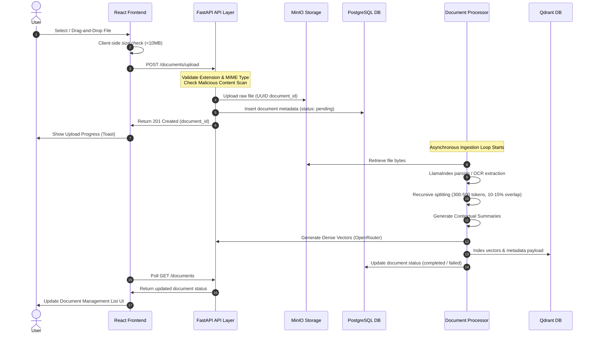
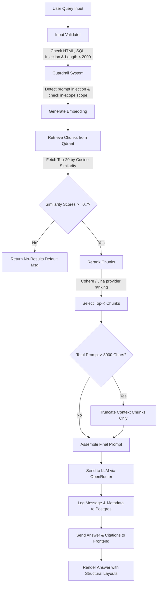

# RAG Chatbot Workspace - System Architecture & Workflows

This document details the tech stack, component interactions, and data workflows of the Retrieval-Augmented Generation (RAG) Chatbot Workspace application.

---

## 1. Technical Stack

The application is structured as a decoupled, multi-container microservice system running in Docker:

```
┌────────────────────────────────────────────────────────┐
│                   React TypeScript UI                  │
└───────────────────────────┬────────────────────────────┘
                            │ REST APIs / CORS
┌───────────────────────────▼────────────────────────────┐
│                    FastAPI Backend                     │
└─────┬─────────────────────┬──────────────────────┬─────┘
      │ SQLAlchemy          │ MinIO Client         │ Qdrant Client
┌─────▼───────────┐   ┌─────▼───────────┐   ┌──────▼──────────┐
│   PostgreSQL    │   │      MinIO      │   │  Qdrant Vector  │
│ (Metadata DB)   │   │ (Object Store)  │   │     Database    │
└─────────────────┘   └─────────────────┘   └─────────────────┘
```

### Component Details
*   **Frontend**: Built with **React 19**, **TypeScript**, and **Vite** for a fast development workflow. Styling is implemented with vanilla CSS, optimizing responsive grids for mobile, tablet, and desktop breakpoints.
*   **Backend**: Built with **FastAPI**, providing high-performance, asynchronous routing, rate limiting middleware, CORS validation, and structured JSON error response formats.
*   **Database (Metadata Store)**: **PostgreSQL** handles structured schema metadata:
    *   `documents`: Records the document filename, size, format, upload date, and asynchronous parsing status.
    *   `chat_sessions` / `chat_messages`: Records historical conversation flows, message timelines, and RAG retrieval/reranking performance metadata.
*   **Object Store**: **MinIO** (an S3-compatible local store) handles storage of raw document files.
*   **Vector Database**: **Qdrant** handles indexing and semantic search over dense embedding vectors.
*   **External API Providers**:
    *   **OpenRouter**: Provides OpenAI-compatible access to embedding models (`openai/text-embedding-3-small`) and LLM text generation (`openai/gpt-4o`).
    *   **Cohere / Jina**: Providers for Reranking services to optimize semantic document alignment.

---

## 2. Ingestion & Document Processing Workflow

When a user uploads a document to the workspace, the system executes the following synchronous validation and asynchronous processing pipeline:



### Detailed Ingestion Workings
1.  **Validation**: Uploads are restricted to supported formats (`pdf`, `docx`, `pptx`, `xlsx`, `xls`, `txt`, `png`, `jpg`, `jpeg`). If the file extension does not match its parsed MIME headers, or if the size exceeds 10 MB, the request is rejected with a `400 Bad Request` payload.
2.  **Storage Isolation**: Raw files are placed inside MinIO, producing a unique `document_id` UUID.
3.  **Parsing & OCR**: 
    *   PDF and DOCX are parsed using native structural parsers.
    *   PPTX and spreadsheets are parsed via layout-preserving text extractors.
    *   Images undergo optical character recognition (OCR) to extract embedded text.
4.  **Chunking & Summary Generation**: Text is split into chunks of 300 to 500 tokens with 10% to 15% overlap. To combat search loss-in-the-middle, the pipeline injects contextual summaries (synthesized via LLM) into adjacent chunk payloads.
5.  **Vector Storage**: Vectors are generated and written to Qdrant alongside a payload including:
    *   `chunk_id` / `document_id`
    *   `chunk_text`
    *   `position_in_document`
    *   `contextual_summary`

---

## 3. RAG Retrieval & Chat Workflow

When a user submits a query to chat with their documents, the system passes the prompt through validators, guardrails, retrieval, reranking, and truncation steps:



### Detailed Chat Workings
1.  **Input Validator**: Sanitizes inputs (strips HTML `<script>` tags, filters out SQL injection patterns like `' OR 1=1`) and enforces a client-side and server-side hard ceiling of 2000 characters.
2.  **Guardrail System**:
    *   **Scope Detection**: Ensures query relates to uploaded files (rejects out-of-scope requests, e.g. recipe requests, weather lookups).
    *   **Prompt Injection Detection**: Blocks overrides (e.g. *"ignore previous instructions"*).
3.  **Vector Retrieval**: The engine performs a search query in Qdrant, retrieving up to 20 raw chunks. If the similarity scores of all chunks fall below the `0.7` threshold, the query immediately short-circuits and returns a default no-results message without making an expensive LLM call.
4.  **Rerank Engine**: Retrieves the chunks and passes them to the active Reranking provider (Cohere or Jina). If the provider fails, the system falls back gracefully to the original Qdrant similarity scores.
5.  **Prompt Construction & Truncation**:
    *   Injects system instructions, query text, and top-k context chunks into the prompt template.
    *   If the result exceeds 8,000 characters, it dynamically truncates only the lowest-scoring context chunks, preserving system instructions and the user query intact.
6.  **LLM Dispatch**: The prompt is processed by `openai/gpt-4o` to generate the grounded response.
7.  **Interaction Logging**: The system commits the interaction details to PostgreSQL, recording:
    *   `session_id` and `timestamp`
    *   `query_text` and generated `response`
    *   `retrieved_chunk_ids` and their `reranking_scores`
    *   `reranking_provider` and performance metrics (`reranking_duration_ms`)
8.  **UI Citation Rendering**: The React frontend renders the response preserving paragraphs and lists, and provides a citation drawer containing the exact chunks, similarity scores, and document sources used.
